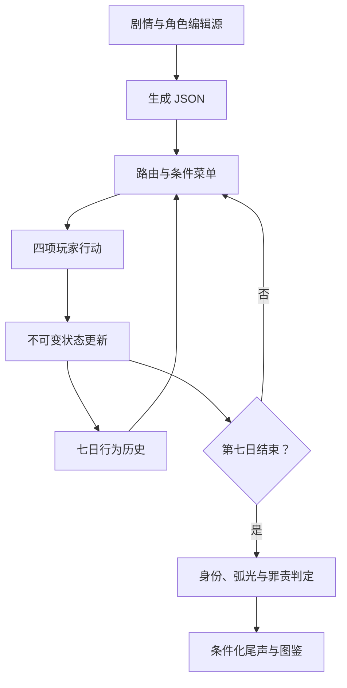

# 技术架构与接手约定

## 选型

本版选择无第三方运行依赖的浏览器JavaScript纯函数引擎＋数据JSON＋TypeScript接口。HTML/CSS只负责呈现。原因是用户应当下载一个HTML就能真正玩完，而不是先排查构建工具与网络。源代码、内容、测试分离，单文件只是生成产物。

| 方案 | 本项目用途 | 当前取舍 |
|---|---|---|
| 纯前端JS＋TS接口 | 离线七日原型、确定性规则、小规模UI | 已实现，最少运行依赖 |
| React＋TypeScript＋Vite | 后续较大图鉴、内容编辑器、组件复用 | 可平移引擎；当前没有为框架包装增加依赖 |
| Next.js | 有服务端账号、云存档与运营页面时 | 首版没有这些需求，不引入服务端 |
| Godot | 大量场景动画、音频、桌面交互 | 可以消费JSON，首版文本主导时转换成本更高 |
| Ren’Py | 立绘与长对话驱动的视觉小说 | 七日规则、动态四菜单与组合结局仍需自定义逻辑 |
| Electron／Tauri | 后期桌面安装包与文件存档 | 尚未打包，先验收Web内容与操作 |

以上是功能需求的工程判断，不依赖框架实时排行榜或未经核实的版本性能。

## 数据流

## 文件职责

- scripts/content.py：全部人工编写的节点、行动和四套条件终局。每行显式给出文字、下一资格、主要人格、行为与后果。
- scripts/lore.py：固定称号白名单、弧光、角色。
- scripts/epilogues.py：24重点结局编辑稿。
- scripts/build.py：展开节点、choices、flags、前置索引，导出各JSON和完整策划参考。生成内容可以读取，修改应回到编辑源，避免下次构建覆盖。
- data/story.json：节点、四个choice引用、前置与variants条件。data/choices.json：行动完整可见／隐藏字段。
- data/characters.json、arcs.json、flags.json、endings.json、epilogues.json：各独立资源。data/bundle.json为运行时索引。
- src/engine.js：纯函数状态与路由、条件菜单、事件回放、确定性结局。没有DOM或存储调用。
- src/models.ts：正式接口和判别联合。当前运行实现为JS；没有声称整个工程已经迁移并通过TypeScript编译。
- src/ui.js、style.css：玩家界面、单槽存档、图鉴、导入／导出、防重复提交。
- scripts/pack.py：读取最近测试报告，标记可达称号，再生成dist/SeventhDay.html。无需外网字体、图片或CDN。
- tests/exhaustive.cjs：两种周目状态完整穷举；tests/random.cjs：可设种子的随机烟测。
- tests/browser.cjs：真实浏览器操作验收脚本；当前环境未完成执行，见QA。

## 状态与保存

GameState包含schemaVersion、当前nodeId、day、八维stats、六方relations、不可撤销flags、七项history、finished、role、周目元信息。每项history保存前后快照以供审计。

存档只接受SaveFile接口中的schemaVersion、choiceIds、meta。通过从初始状态重新apply来校验合法性，而不是相信导入文件中任意分数。剧情版本变更时必须提升schemaVersion并提供明确迁移／拒绝策略，不能把旧节点ID解释成新含义。

profile保存通关总数、已发现称号、当前本局、runId和已计数runId；终局刷新不会增加计数。没有后端加密，用户可编辑本地文件；这与单机无竞争的设计相容。导出的是本局而非整个账号档案，图鉴跨设备迁移尚未实现。

## 条件菜单

一般next_node显式指定下一日基础节点。apply先应用本次状态变化，再按data.variants中有序条件检查目标。首个命中的变体替代基础节点；每个变体仍恰好四项且拥有独立行动及结果。

条件支持all、any、none三个旗标集合。它们保留明确语义，不执行字符串表达式或eval。当前只设四个高价值终局变体，避免多个任意predicate互相拼接导致选项数不等于四。若未来新增多条件，必须为优先级冲突补专门见证路径。

## 性能、扩展与内容编辑

完整路径只有4^7，优先全量穷举而非先上概率抽样。无后端、无付费API、无每次生成剧情调用。把剧情扩到十天以前先重新评估穷举成本。

未来React迁移只包UI，不重写E.apply／E.finish。若引入NPC个人信任，把它加入快照、导入回放、尾声与条件测试；不要只做无影响的进度条。若加入音频、美术，提供资源许可证清单和离线回退。
